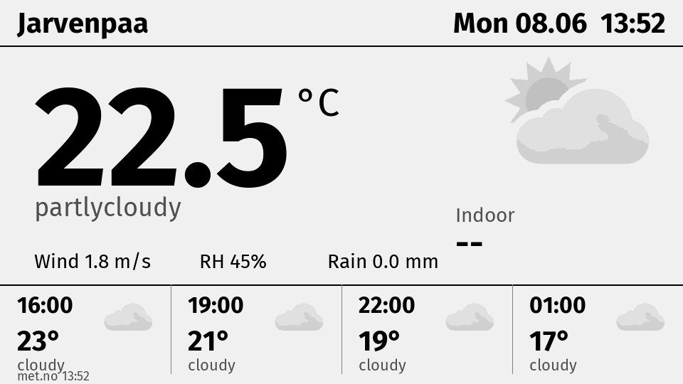

# lilygo-eink

E-paper weather display for a LILYGO T5 4.7" V2.3 (ESP32-S3, 960×540 grayscale). Device wakes every 15 min, fetches a pre-rendered 4-bit framebuffer from a small Python server, pushes it to the panel, deep-sleeps.



## Layout

- **`server/`** — Python service. Fetches [api.met.no](https://api.met.no/) + optional Home Assistant sensor states, renders 960×540 grayscale with Pillow, packs to 4-bit (259200 B), serves over HTTP as `/eink.bin`. Docker image published to `ghcr.io/lepinkainen/lilygo-eink-server`. See [`server/README.md`](server/README.md).
- **`src/main.cpp`** — Arduino-framework firmware. Streams the HTTP response straight into the EPD framebuffer, no JSON parsing on-device. Built with PlatformIO.

Split deliberately so layout iteration doesn't require a re-flash.

## Quick start

Firmware:

```sh
cp include/secrets.h.example include/secrets.h && $EDITOR include/secrets.h
pio run -t upload --upload-port /dev/cu.usbmodem101
```

Server:

```sh
cd server
uv sync
cp config.toml.example config.toml && $EDITOR config.toml
uv run app.py --preview /tmp/p.png   # smoke-test
uv run app.py                        # serve on :8080
```

Or via Docker:

```sh
docker run -d --name lilygo-render -p 8080:8080 \
  -v $PWD/server/config.toml:/app/config.toml:ro \
  ghcr.io/lepinkainen/lilygo-eink-server:latest
```

## Docs

- [`CLAUDE.md`](CLAUDE.md) — architecture, hardware quirks, refresh strategy, wire format.
- [`server/README.md`](server/README.md) — server setup, layout iteration loop, Portainer deploy.
